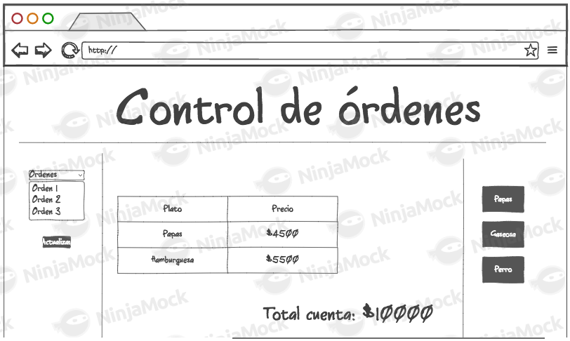

### Escuela Colombiana de Ingeniería
### Arquiecturas de Software

## Construción de un cliente 'grueso' con un API REST, HTML5, Javascript y CSS3. Parte I.

### Trabajo individual o en parejas. A quienes tuvieron malos resultados en el parcial anterior se les recomienda hacerlo individualmente.

* Al oprimir 'Get blueprints', consulta los planos del usuario dado en el formulario. Por ahora, si la consulta genera un error, sencillamente no se mostrará nada.
* Al hacer una consulta exitosa, se debe mostrar un mensaje que incluya el nombre del autor, y una tabla con: el nombre de cada plano de autor, el número de puntos del mismo, y un botón para abrirlo. Al final, se debe mostrar el total de puntos de todos los planos (suponga, por ejemplo, que la aplicación tienen un modelo de pago que requiere dicha información).
* Al seleccionar uno de los planos, se debe mostrar el dibujo del mismo. Por ahora, el dibujo será simplemente una secuencia de segmentos de recta realizada en el mismo orden en el que vengan los puntos.

## Ajustes Backend

1. Trabaje sobre la base del proyecto anterior (en el que se hizo el API REST).
2. Incluya dentro de las dependencias de Maven los 'webjars' de jQuery y Bootstrap (esto permite tener localmente dichas librerías de JavaScript al momento de construír el proyecto):

## Front-End - Vistas

1. Cree el directorio donde residirá la aplicación JavaScript. Como se está usando SpringBoot, la ruta para poner en el mismo contenido estático (páginas Web estáticas, aplicaciones HTML5/JS, etc) es:  

    

4. Cree, en el directorio anterior, la página index.html, sólo con lo básico: título, campo para la captura del autor, botón de 'Get blueprints', campo 
 donde se mostrará el nombre del autor seleccionado, [la tabla HTML](https://www.w3schools.com/html/html_tables.asp) donde se mostrará el listado de planos (con sólo los encabezados), y un campo 
 donde se mostrará el total de puntos de los planos del autor. Recuerde asociarle identificadores a dichos componentes para facilitar su búsqueda mediante selectores.

   

6. En el elemento \<head\> de la página, agregue las referencia a las librerías de jQuery, Bootstrap y a la hoja de estilos de Bootstrap. 

5. Suba la aplicación (mvn spring-boot:run), y rectifique:
    1. Que la página sea accesible desde el URL (ver imagen).
    2. Al abrir la consola de desarrollador del navegador, NO deben aparecer mensajes de error 404 (es decir, que las librerías de JavaScript se cargaron correctamente).

## Front-End - Lógica

1. Ahora, va a crear un Módulo JavaScript que, a manera de controlador, mantenga los estados y ofrezca las operaciones requeridas por la vista. Para esto tenga en cuenta el [patrón Módulo de JavaScript](https://toddmotto.com/mastering-the-module-pattern/), y cree un módulo en la ruta static/js/app.js .

2. Copie el módulo provisto (apimock.js) en la misma ruta del módulo antes creado. En éste agréguele más planos (con más puntos) a los autores 'quemados' en el código.

   

4. Agregue la importación de los dos nuevos módulos a la página HTML (después de las importaciones de las librerías de jQuery y Bootstrap):

    

5. Haga que el módulo antes creado mantenga de forma privada:
    * El nombre del autor seleccionado.
    * El listado de nombre y tamaño de los planos del autor seleccionado. Es decir, una lista objetos, donde cada objeto tendrá dos propiedades: nombre de plano, y número de puntos del plano.

    Junto con una operación pública que permita cambiar el nombre del autor actualmente seleccionado.

6. Agregue al módulo 'app.js' una operación pública que permita actualizar el listado de los planos, a partir del nombre de su autor (dado como parámetro). Para hacer esto, dicha operación debe invocar la operación 'getBlueprintsByAuthor' del módulo 'apimock' provisto, enviándole como _callback_ una función que:

    * Tome el listado de los planos, y le aplique una función 'map' que convierta sus elementos a objetos con sólo el nombre y el número de puntos.

    * Sobre el listado resultante, haga otro 'map', que tome cada uno de estos elementos, y a través de jQuery agregue un elemento \<tr\> (con los respectvos \<td\>) a la tabla creada en el punto 4. Tenga en cuenta los [selectores de jQuery](https://www.w3schools.com/JQuery/jquery_ref_selectors.asp) y [los tutoriales disponibles en línea](https://www.tutorialrepublic.com/codelab.php?topic=faq&file=jquery-append-and-remove-table-row-dynamically). Por ahora no agregue botones a las filas generadas.

    * Sobre cualquiera de los dos listados (el original, o el transformado mediante 'map'), aplique un 'reduce' que calcule el número de puntos. Con este valor, use jQuery para actualizar el campo correspondiente dentro del DOM.
  
      

7. Asocie la operación antes creada (la de app.js) al evento 'on-click' del botón de consulta de la página.

8. Verifique el funcionamiento de la aplicación. Inicie el servidor, abra la aplicación HTML5/JavaScript, y rectifique que al ingresar un usuario existente, se cargue el listado del mismo.

## Para la próxima semana

8. A la página, agregue un [elemento de tipo Canvas](https://www.w3schools.com/html/html5_canvas.asp), con su respectivo identificador. Haga que sus dimensiones no sean demasiado grandes para dejar espacio para los otros componentes, pero lo suficiente para poder 'dibujar' los planos.

9. Al módulo app.js agregue una operación que, dado el nombre de un autor, y el nombre de uno de sus planos dados como parámetros, haciendo uso del método getBlueprintsByNameAndAuthor de apimock.js y de una función _callback_:
    * Consulte los puntos del plano correspondiente, y con los mismos dibuje consectivamente segmentos de recta, haciendo uso [de los elementos HTML5 (Canvas, 2DContext, etc) disponibles](https://www.w3schools.com/html/tryit.asp?filename=tryhtml5_canvas_tut_path)* Actualice con jQuery el campo 
 donde se muestra el nombre del plano que se está dibujando (si dicho campo no existe, agruéguelo al DOM).

10. Verifique que la aplicación ahora, además de mostrar el listado de los planos de un autor, permita seleccionar uno de éstos y graficarlo. Para esto, haga que en las filas generadas para el punto 5 incluyan en la última columna un botón con su evento de clic asociado a la operación hecha anteriormente (enviándo como parámetro los nombres correspondientes).

11. Verifique que la aplicación ahora permita: consultar los planos de un auto y graficar aquel que se seleccione.

12. Una vez funcione la aplicación (sólo front-end), haga un módulo (llámelo 'apiclient') que tenga las mismas operaciones del 'apimock', pero que para las mismas use datos reales consultados del API REST. Para lo anterior revise [cómo hacer peticiones GET con jQuery](https://api.jquery.com/jquery.get/), y cómo se maneja el esquema de _callbacks_ en este contexto.

13. Modifique el código de app.js de manera que sea posible cambiar entre el 'apimock' y el 'apiclient' con sólo una línea de código.

    
    

15. Revise la [documentación y ejemplos de los estilos de Bootstrap](https://v4-alpha.getbootstrap.com/examples/) (ya incluidos en el ejercicio), agregue los elementos necesarios a la página para que sea más vistosa, y más cercana al mock dado al inicio del enunciado.

# Autor

## Daniel Alejandro Acero
